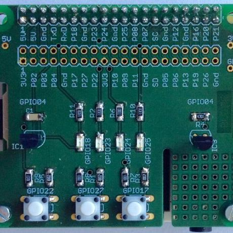

# Program examples and utilities for Raspberry Pi 

## Programming 
(_directories: Python, Qt, c, curses-games_)

For compiling / running the code examples, the following software packages are needed - most of them
are part of _Raspberry Pi OS bullseye_ distribution and can be installed with ```sudo apt install <package name>```.

- Qt Widget:
```qtbase5-dev qtchooser qt5-qmake qtbase5-dev-tools qtcreator```

- QML: 
```qml-module-qtquick-* qtquickcontrols2* qtdeclarative5-dev```

- PyQt:
```python3-pyqt5*  pyqt5-dev-tools python3-paho-mqtt```

- curses:
```ncurses-dev```

There is one important exception: _wiringPi_, which was used for all examples for controlling GPIO so far, is no longer
available in the latest Raspberry OS release. As a replacement, I have decided to use _lgpio_, because of mainly two
strong points: (1) It uses the new _gpiochip_ kernel interface and (2) it does not require ```sudo``` for
running the compiled programs. Unfortunately, it is not (yet) part of the distribution. You have to build and install
it from source <http://abyz.me.uk/lg/download.html>.


## BULME Hat hardware
(_directory: hardware_)



Board Dimensions: 65 x 56 mm

(TOP) *Name-Layer and Value Layer*  -> *Silkscreen*

*Important Notice:* Unless otherwise specified, Eagle files
use layer 21 and 25 for silkscreen

## Shell scripts etc. for Raspberry Pi setup
(_directory: tools_)

- find-raspi.php
Run this in a webserver to find ip address of Raspberry in subnet (if zeroconf is unavailable)

- klabu
Ping all hostnames.local from list in subnet


